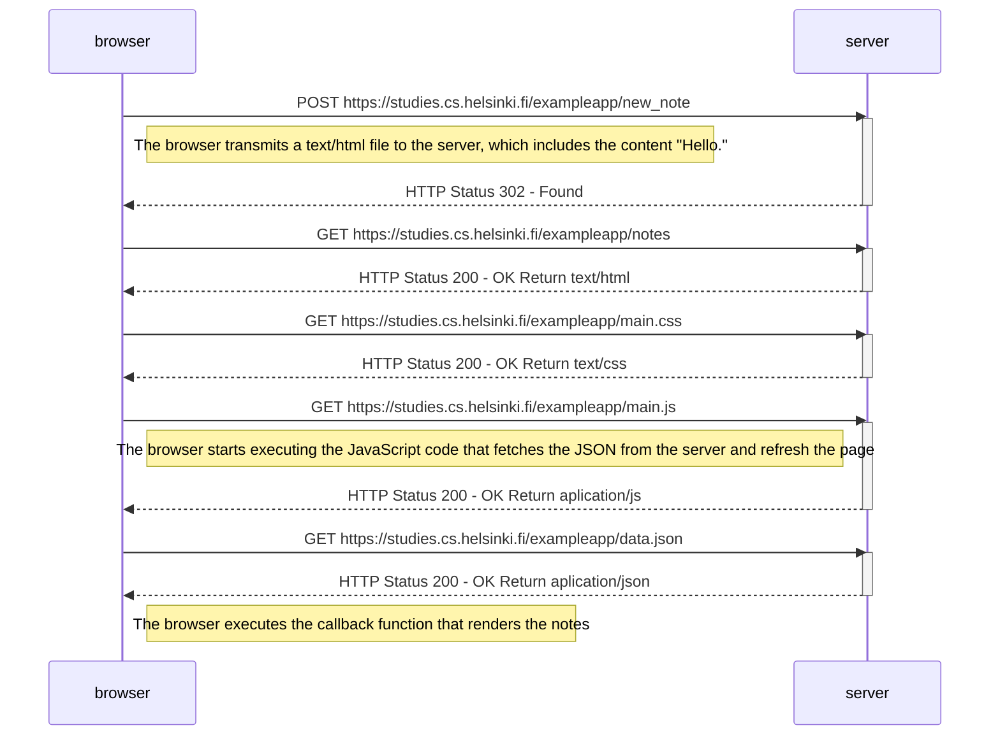
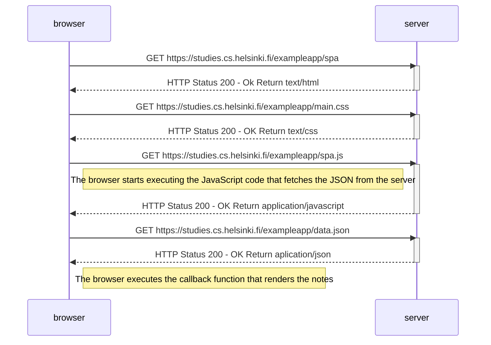
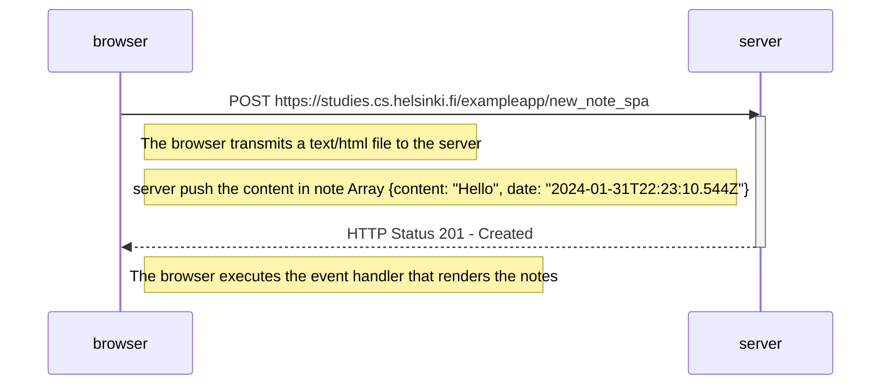

# Part 0 - Fundamentals of Web apps

Course overview: It provides an initial understanding of the course, covering fundamental concepts such as HTTP requests, the functioning of traditional web applications, DOM, CSS, and Single Page Applications.

[new note](./0.4.mmd) - Diagram illustrating browser-server communication: The diagram illustrates the interaction between the browser and the server when a user adds a note to a page with JavaScript. 

[SPA](./0.5.mmd) - Single-page app communication: The diagram depicts how the browser and server communicate when a user opens a single-page app in the browser.

[SPA new note](./0.6.mmd) - Adding a note to a single-page app: The diagram showcases the communication between the browser and the server when a user adds a note to a single-page app.
